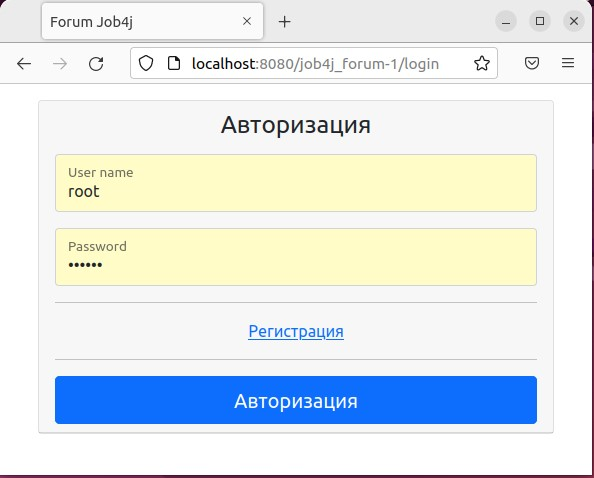
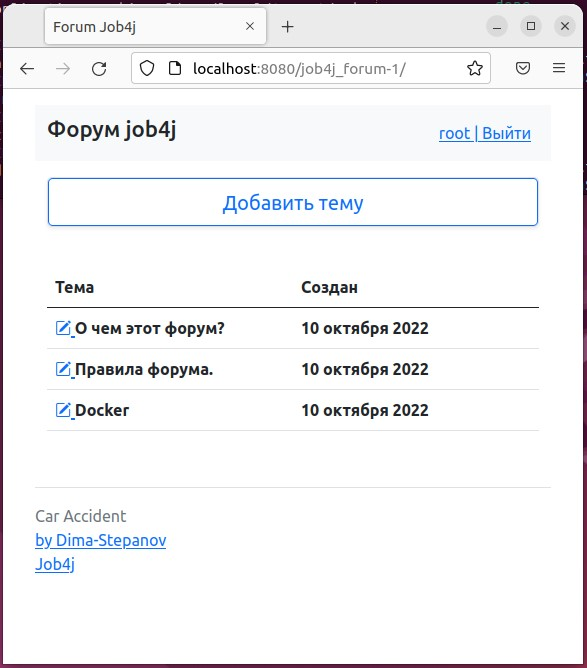

<h1>Проект Job4j_Forum</h1>
<h3>Стек Spring Boot, thymeleaf, bootstrap, PostgreSQL</h3>

Для запуска проекта:
Описанные ниже действия для ОС Linux Ubuntu/Mint/
1. Установите docker и docker-compose.
2. Создайте каталог projects. Команда <b>mkdir projects</b>. Перейдите в каталог projects. Команда <b>cd projects</b>.
3. Создайте каталог job4j_forum. Команда <b>mkdir job4j_forum</b>. Перейдите в каталог projects. Команда <b>cd job4j_forum</b>.
4. Скачиваем скрипт YML из репозитория командой <b>wget -O docker-compose.yml https://raw.githubusercontent.com/Dima-Stepanov/job4j_forum/master/docker-compose.yml </b>  
5. Проверяем что не работающих контейнеров postgres или tomcat командой <b>docker ps</b>. Если такие есть останавливаем иначе возможен конфликт портов.
6. Выполнить запуск проекта через команду <b>docker-compose up</b>
7. В браузере перейдите по ссылке http://localhost:8080/job4j_forum-1/

Отобразится стартовая страница авторизации 

 

Для авторизации зарегистрируйтесь или введите логин root пароль password 

После успешной авторизации откроется основная страница приложения 

 

Для остановки приложения откройте консоль, в каталоге projects/job4j_forum выполняем команду <b>docker-compose down</b> .   

<h3>Ссылка на образ <a href="https://hub.docker.com/repository/docker/dima202020/job4j_forum">Docker images</a></h3> 

<h3>Ссылка на репозиторий <a href="https://github.com/Dima-Stepanov/job4j_forum">job4j_form</a></h3>

  